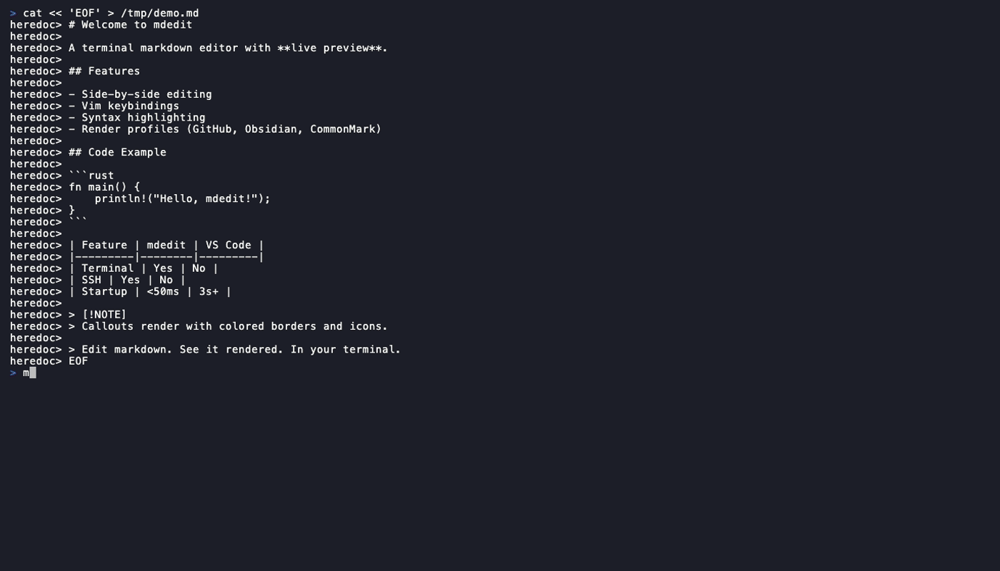

# mdedit

A terminal markdown editor with live rendered preview. Edit raw markdown on one side, see it rendered on the other — no browser, no bloated IDE, no vault lock-in.



### Demo Video

https://github.com/user-attachments/assets/8fdf074f-c237-4759-a589-46ab6648425d

## Install

```bash
# Quick install (macOS / Linux)
curl -fsSL https://raw.githubusercontent.com/sho-luv/mdedit/main/install.sh | sh
```

```bash
# From source (requires Rust 1.75+)
cargo install --git https://github.com/sho-luv/mdedit.git
```

Pre-built binaries are available on the [Releases](https://github.com/sho-luv/mdedit/releases) page.

## Usage

```bash
mdedit file.md          # Edit existing file
mdedit new-file.md      # Creates file if it doesn't exist
mdedit --theme dracula   # Override color theme
mdedit --mode nano       # Use nano-style keybindings
```

## Features

- Side-by-side editor + live rendered preview
- Vim-style modal editing (Normal/Insert/Visual/Command)
- Syntax highlighting in editor pane
- Configurable color themes (ocean, dracula, solarized-light, gruvbox-dark)
- System clipboard integration (OSC 52 + platform-native)
- Mouse support (click, scroll, drag-select, resize panes)
- Text search with highlighting
- Works over SSH
- 2.8MB binary, <50ms startup

## Keybindings

### Vim Mode (default)

#### Normal Mode
| Key | Action |
|-----|--------|
| `h/j/k/l` | Move cursor |
| `w/b/e` | Word forward/back/end |
| `0/$` | Line start/end |
| `gg/G` | File start/end |
| `i/a/o/O` | Enter insert mode |
| `d{motion}` | Delete |
| `c{motion}` | Change (delete + insert) |
| `y{motion}` | Yank (copy) |
| `p/P` | Paste after/before |
| `dd/yy/cc` | Line operations |
| `x` | Delete character |
| `u` | Undo |
| `Ctrl+R` | Redo |
| `v/V` | Visual mode (char/line) |
| `/` | Search |
| `:w` | Save |
| `:q` | Quit |
| `:wq` | Save and quit |
| `:q!` | Force quit |

#### Insert Mode
| Key | Action |
|-----|--------|
| `Esc` | Return to Normal mode |
| All keys | Type normally |

### Nano Mode

| Key | Action |
|-----|--------|
| `Ctrl+S` | Save |
| `Ctrl+Q` | Quit |
| `Ctrl+F` | Search |
| `Ctrl+C` | Copy selection to clipboard |
| `Ctrl+V` | Paste from clipboard |
| `Tab/Shift+Tab` | Indent/outdent |

### Global (both modes)

| Key | Action |
|-----|--------|
| `Ctrl+P` | Toggle view: split / editor only / preview only |
| Mouse wheel | Scroll editor or preview |
| Click | Position cursor |
| Drag divider | Resize panes |

## Configuration

Settings can be changed live with `:set` in vim mode, which opens an interactive settings panel. Changes can be saved to persist across sessions.

| Command | Action |
|---------|--------|
| `:set` | Open settings panel |
| `:set theme dracula` | Switch theme directly |
| `:set mode nano` | Switch mode (restart to apply) |
| `:set save` | Save current settings to config file |

Config file: `~/.config/mdedit/config.toml`

```toml
# Editing mode: "vim" (default) or "nano"
mode = "vim"

# Color theme
theme = "ocean"

# Custom theme example
[themes.my-theme]
editor_bg = "#1a1b26"
editor_fg = "#a9b1d6"
line_number = "#3b4261"
cursor_line_bg = "#24283b"
selection_bg = "#364a82"
status_bar_bg = "#1a1b26"
status_bar_fg = "#7aa2f7"
preview_bg = "#1a1b26"
preview_fg = "#a9b1d6"
preview_heading = "#7aa2f7"
preview_code_bg = "#24283b"
search_match_bg = "#e0af68"
search_match_fg = "#1a1b26"
```

### Built-in Themes

- `ocean` — Default dark blue theme
- `dracula` — Purple-tinted dark theme
- `solarized-light` — Light theme
- `gruvbox-dark` — Warm dark theme

## Clipboard

Clipboard works automatically:
- **Local**: Uses `pbcopy`/`pbpaste` (macOS) or `xclip`/`wl-copy` (Linux)
- **SSH**: Uses OSC 52 escape sequences (works in most modern terminals)
- **tmux**: Auto-detects and wraps in DCS passthrough

Every yank and delete syncs to system clipboard. Paste reads from system clipboard.

## Requirements

- Rust 1.75+ (to build)
- A terminal with ANSI color support
- macOS or Linux
